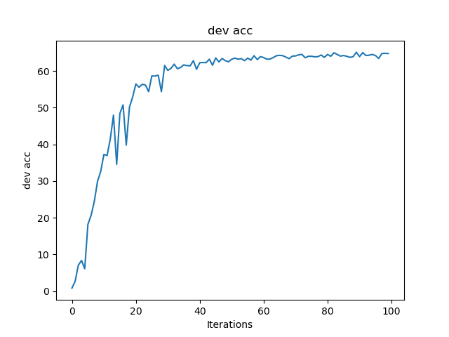
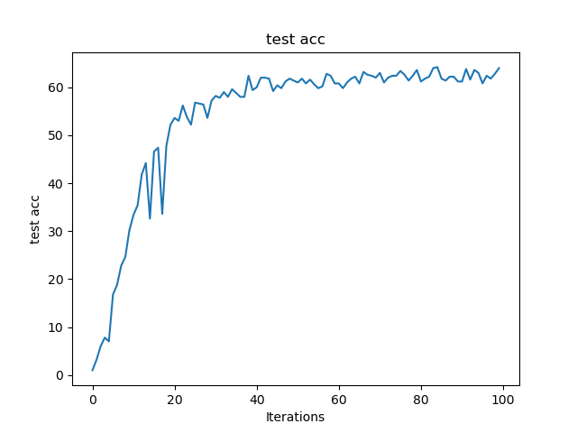
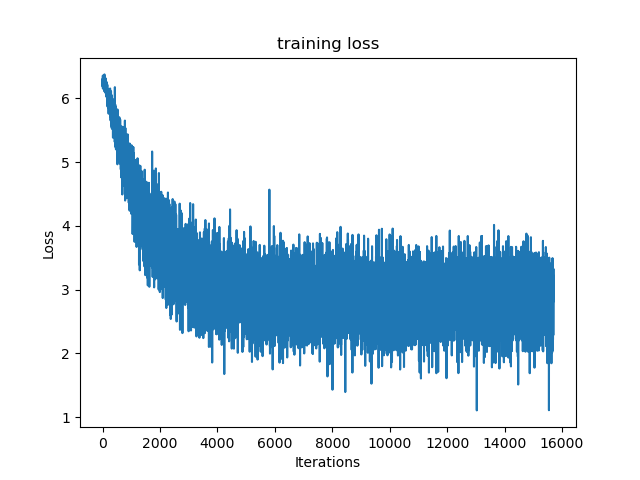

# 人工神经网络 期中项目

20337251 伍建霖

## 一、神经网络原理

### 卷积层Conv

每次作用于图像的一部分，用于提取图像的局部特征。有以下几种参数：

1. channel：输入输出通道数，rgb为三通道
2. kernel_size：卷积核大小
3. stride：步长，即每次卷积核移动的像素个数
4. padding：填充的像素个数

### 激活函数

激活函数是用来加入非线性因素的，因为线性模型的表达力不够。常用激活函数有以下几种：

1. ReLu：${max(x, 0)}$
2. sigmoid：${\frac {1}{1+e^{-x}}}$
3. tanh：${\frac {e^x-e^{-x}}{e^x+e^{-x}}}$

### 池化层

对输入的特征图进行压缩，一方面使特征图变小，简化网络计算复杂度；一方面进行特征压缩，提取主要特征。还具有平移不变性和旋转不变性。往往在卷积层后面使用，通过池化来降低卷积层输出的特征向量，同时改善结果，避免过拟合。有以下几种常用的池化层：

1. 最大池化：取窗口内最大值
2. 平均池化：取窗口内平均值

### 批归一化BN

操作：先求平均值与方差，再标准化即可

作用：做了归一化之后，可以近似的认为训练数据和测试数据满足相同分布(即均值为0，方差为1的标准正态)，这样一来模型的泛化能力会得到提高。其次：如果不做归一化，使用mini-batch梯度下降法训练的时候，每批训练数据的分布不相同，那么网络就要在每次迭代的时候去适应不同的分布，这样会大大降低网络的训练速度。

### 全连接层FC

全连接层一般会把卷积输出的二维特征图转化为一维的一个向量，全连接层的每一个节点都与上一层的每个节点连接，是把前一层的输出特征都综合起来，所以该层的权值参数是最多的。全连接网络的作用就是将最后一层卷积得到的特征flatten成向量，对这个向量做乘法，最终降低其维度，然后输入到softmax层中得到对应的每个类别的得分。但参数量过大，特别是与最有一个卷积层（池化层）相连的全连接层。参数量过大会导致训练速度降低，容易过拟合。

### 随机失活Dropout

在训练阶段按某种概率随即将输入的张量元素随机归零，用于防止网络过拟合。

### 随机梯度下降SGD

简单来说就是从样本中随机抽出一组，训练后按梯度更新一次，然后再抽取一组，再更新一次。在每次更新时用1组样本，用这组样本来近似所有的样本，以此更新参数。虽然不是每次迭代得到的损失函数都向着全局最优方向， 但是大的整体的方向是向全局最优解的，最终的结果往往是在全局最优解附近。

### 数据增强

对数据进行变化，使模型具有泛化能力。就图像数据而言，有以下数据增强操作：

1. 裁剪：中心裁剪，随机裁剪
2. 翻转和旋转：水平翻转，垂直翻转，随机旋转
3. 图像变化：亮度，对比度，饱和度，色相
4. 操作本身：随机顺序，随机执行，

## 二、实验代码

### 搭建网络

这里我使用pytorch的nn.module来搭建神经网络。

我最终的网络架构是参考Alexnet的，本来想把Alexnet中的卷积核再调小一点的，但受限于GPU显存不足，只能设置为7x7的。我把一个卷积层+一个激活函数+一个最大池化+一个批归一化层作为一个大层，这样的大层来4层，后面接三个全连接层和一个dropout层。

```python
# 定义卷积神经网络模型
class Net(nn.Module):
    def __init__(self):
        super(Net, self).__init__()
        self.conv1 = nn.Sequential(
            nn.BatchNorm2d(3),
            nn.Conv2d(3, 96, 7, 2, 1,),
            nn.ReLU(),
            nn.MaxPool2d(2),
            nn.BatchNorm2d(96),
        )
        self.conv2 = nn.Sequential(
            nn.Conv2d(96, 256, 3, 1, 1), nn.ReLU(), nn.MaxPool2d(2), nn.BatchNorm2d(256)
        )
        self.conv3 = nn.Sequential(
            nn.Conv2d(256, 384, 3, 1, 1),
            nn.ReLU(),
            nn.MaxPool2d(2),
            nn.BatchNorm2d(384),
        )
        self.conv4 = nn.Sequential(
            nn.Conv2d(384, 512, 3, 1, 1),
            nn.ReLU(),
            nn.MaxPool2d(2),
            nn.BatchNorm2d(512),
        )
        self.fc1 = nn.Linear(512 * 6*6, 2048)
        self.fc2 = nn.Linear(2048, 2048)
        self.fc3 = nn.Linear(2048, 500)
        self.dropout = nn.Dropout(p=0.5)

    def forward(self, x):
        x = self.conv1(x)
        x = self.conv2(x)
        x = self.conv3(x)
        x = self.conv4(x)
        x = x.view(x.size(0), -1)  # 展平多维的卷积图层
        x = self.fc1(x)
        x = self.fc2(x)
        x = self.fc3(x)
        x = self.dropout(x)
        return x
```

### 数据增强

这里我使用pytorch的tranform，使得在数据预处理阶段就进行数据增强。

依次调整了图像的亮度，饱和度，对比度和色相，以及随机水平翻转。

```python
transform = transforms.Compose(
    [
        transforms.ColorJitter(brightness=0.5),
        transforms.ColorJitter(saturation=0.5),
        transforms.ColorJitter(contrast=0.5),
        transforms.ColorJitter(hue=0.5),
        transforms.RandomHorizontalFlip(0.5),
        transforms.Resize((224, 224)),
        transforms.ToTensor(),
    ]
)
```

### 读入数据

这里我使用imagefolder读入数据，用dataloader设置数据集，用上面的tranform设置数据预处理并设置shuffle来打乱数据

```python
train_dataset = ImageFolder(
    "./face_classification_500/train_sample", transform=transform
)
train_loader = DataLoader(train_dataset, batch_size=64, shuffle=True)
dev_dataset = ImageFolder("./face_classification_500/dev_sample", transform=transform)
dev_loader = DataLoader(dev_dataset, batch_size=64, shuffle=False)
test_dataset = ImageFolder("./face_classification_500/test_sample", transform=transform)
test_loader = DataLoader(test_dataset, batch_size=64, shuffle=False)
```

### 设置参数

这里用to()来指定设备，"GPU:0"表示用的GPU，"CPU"表示用的CPU。loss函数使用的交叉熵函数，并设置SGD作为优化器，同时还用scheduler来动态调整学习率。最后的三个数组用于可视化数据。

```python
net = Net().to(devicee)
criterion = nn.CrossEntropyLoss().to(devicee)
optimizer = optim.SGD(net.parameters(), lr=0.009)
scheduler = torch.optim.lr_scheduler.ReduceLROnPlateau(
    optimizer,
    factor=0.98,
    patience=10,
    verbose=False,
    threshold=0.0001,
    threshold_mode="rel",
    cooldown=0,
    min_lr=0,
    eps=1e-08,
)
train_loss = []
dev_acc = []
test_acc = []
```

### 训练阶段

这里我设置了100个epoch，每个epoch都会训练数据和测试。训练数据有以下步骤：按batch读入数据，梯度清零，生成输出，计算loss，反向传播优化参数，优化学习率。

```python
# 训练模型
for epoch in range(100):  # 多次循环数据集
    net.train()
    running_loss = 0.0
    for i, data in enumerate(train_loader, 0):
        # 获取输入数据
        inputs, labels = data
        inputs = inputs.to(devicee)
        labels = labels.to(devicee)
        # print(inputs.shape)
        # print(labels.shape)

        # 梯度清零
        optimizer.zero_grad()

        # 正向传递
        outputs = net(inputs)
        loss = criterion(outputs, labels)

        # 反向传递和优化
        loss.backward()
        optimizer.step()

        # 输出统计信息
        train_loss.append(loss.item())
        running_loss += loss.item()
        if i % 10 == 9:
            # 每10个小批次打印一次统计信息
            scheduler.step(running_loss / 10)
            print("[%d, %5d] loss: %.5f" % (epoch + 1, i + 1, running_loss / 10))
            running_loss = 0.0
```

### 测试阶段

先把net设置为eval，避免dropout影响模型表现，再像训练数据那样读入数据，生成输出，最后统计输出数据。

```python
net.eval()
correct = 0
total = 0
with torch.no_grad():
    for data in dev_loader:
        inputs, labels = data
        inputs = inputs.to(devicee)
        labels = labels.to(devicee)
        outputs = net(inputs)
        _, predicted = torch.max(outputs.data, 1)
        total += labels.size(0)
        correct += (predicted == labels).sum().item()
        print("Accuracy of the network on the dev images: %d %%" % (100 * correct / total))
        dev_acc.append((100 * correct / total))

        correct = 0
        total = 0
        with torch.no_grad():
            for data in test_loader:
                inputs, labels = data
                inputs = inputs.to(devicee)
                labels = labels.to(devicee)
                outputs = net(inputs)
                _, predicted = torch.max(outputs.data, 1)
                total += labels.size(0)
                correct += (predicted == labels).sum().item()
                print("Accuracy of the network on the test images: %d %%" % (100 * correct / total))
                test_acc.append((100 * correct / total))
```

### 数据可视化

```python
plt.plot(train_loss)
plt.title("training loss")
plt.xlabel("Iterations")
plt.ylabel("Loss")
plt.show()

plt.plot(dev_acc)
plt.title("dev acc")
plt.xlabel("Iterations")
plt.ylabel("dev acc")
plt.show()

plt.plot(test_acc)
plt.title("test acc")
plt.xlabel("Iterations")
plt.ylabel("test acc")
plt.show()
```

## 三、实验结果

在验证集上的表现，最后的结果会稳定再在64%左右：



在测试集上的表现，最后的结果会稳定在63：



## 四、遇到的问题

### 梯度爆炸

​	一开始我用的Adam优化器，学习率为0.001，后面改用SGD，看资料说学习率要0.01左右，我设置为0.009，结果梯度越来越大，很快就显示NaN，后面修改网络结构后学习率可以设置到0.009了。

网络上的解释：

​	误差梯度是神经网络训练过程中计算的方向和数量，用于以正确的方向和合适的量更新网络权重。 在深层网络或循环神经网络中，误差梯度可在更新中累积，变成非常大的梯度，然后导致网络权重的大幅更新，并因此使网络变得不稳定。在极端情况下，权重的值变得非常大，以至于溢出，导致 NaN 值。 网络层之间的梯度（值大于 1.0）重复相乘导致的指数级增长会产生梯度爆炸。 梯度爆炸引发的问题 在深度多层感知机网络中，梯度爆炸会引起网络不稳定，最好的结果是无法从训练数据中学习，而最坏的结果是出现无法再更新的 NaN 权重值。

### Loss先上升后下降

在一开始训练的时候出现了loss先上升后下降的情况，这里有chatgpt给出的解释：

```
神经网络的loss先上升后下降可能有以下几个原因：

1. 初始阶段：在训练的初始阶段，神经网络可能会出现loss上升的情况。这是因为初始的随机权重可能导致模型输出不准确，需要通过反向传播和优化算法进行调整，使得loss逐渐减小。

2. 学习率设置：学习率是指定优化算法在每次迭代中更新权重的步长。如果学习率设置过大，可能导致权重更新过快，错过了loss的最优点，造成loss上升。可以尝试降低学习率或使用自适应学习率算法，如Adam等。

3. 模型复杂性：如果神经网络的模型过于复杂，可能会出现loss先上升后下降的情况。这可能是因为网络在学习过程中遇到了局部最优解，导致loss上升。可以考虑简化模型结构、增加正则化项或使用其他优化技术来改善这种情况。

4. 数据质量：如果训练数据存在噪声、标签错误或样本不平衡等问题，可能导致loss的上升。建议对数据进行清洗和预处理，确保数据的质量和平衡性。

5. 过拟合：如果训练数据量较小或模型复杂度较高，可能会导致过拟合现象。在过拟合情况下，模型在训练集上表现良好，但在验证集或测试集上表现较差，造成loss上升。可以采用正则化方法、增加数据量或进行模型简化等措施来减少过拟合。

综上所述，loss先上升后下降可能是由于初始阶段、学习率设置、模型复杂性、数据质量或过拟合等多种因素导致的。需要根据具体情况进行分析和调整。
```

### 梯度消失

​	虽然说我的神经网络最后无论是在验证集还是测试集上的准确率都已经“看起来”稳定了，但其实训练Loss还没有收敛，在2.7左右反复横跳，陷入了梯度消失的情况。也有可能是我loss取得太细了，我把每次的loss都记录下来了，应该记录多次求平均值的。



​	参考了网络上的资料，我尝试了其中一部分，比如说激活函数，批归一化等等，还是没能解决梯度消失的问题。

## 五、参考资料

https://zhuanlan.zhihu.com/p/22538465

[卷积神经网络各层基本知识](https://blog.csdn.net/zong596568821xp/article/details/80459968?utm_medium=distribute.pc_relevant.none-task-blog-2~default~baidujs_baidulandingword~default-0-80459968-blog-89343769.235^v35^pc_relevant_increate_t0_download_v2_base&spm=1001.2101.3001.4242.1&utm_relevant_index=1)

https://zhuanlan.zhihu.com/p/32154263

[梯度爆炸与梯度消失是什么？有什么影响？如何解决？_什么是梯度爆炸_江南蜡笔小新的博客-CSDN博客](https://blog.csdn.net/ftimes/article/details/105837637#:~:text=1.什么是梯度爆炸？ 误差梯度是神经网络训练过程中计算的方向和数量，用于以正确的方向和合适的量更新网络权重。 在深层网络或循环神经网络中，误差梯度可在更新中累积，变成非常大的梯度，然后导致网络权重的大幅更新，并因此使网络变得不稳定。 在极端情况下，权重的值变得非常大，以至于溢出，导致 NaN 值。,网络层之间的梯度（值大于 1.0）重复相乘导致的指数级增长会产生梯度爆炸。 梯度爆炸引发的问题 在深度多层感知机网络中，梯度爆炸会引起网络不稳定，最好的结果是无法从训练数据中学习，而最坏的结果是出现无法再更新的 NaN 权重值。)